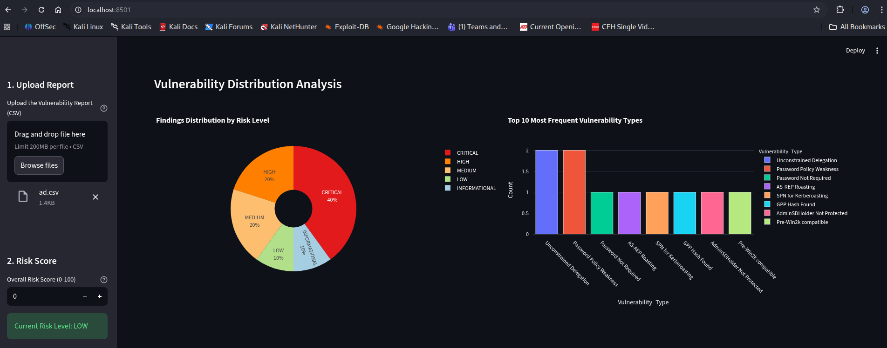
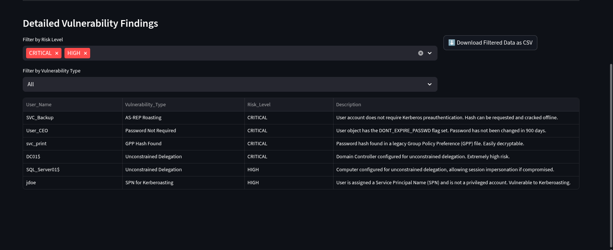

# 🛡️ Enhanced AD Janitor & Security Dashboard

## Project Overview

This toolset is an integrated solution for **Active Directory (AD) Security Assessment and Visualization**. It is designed to perform deep domain enumeration, identify critical vulnerabilities, and provide an interactive web dashboard for security analysis and prioritized remediation.

| File Name | Description |
| :--- | :--- |
| `AD_janitor.py` | The core console utility. Connects to the Domain Controller (DC) to enumerate users, groups, and computers, scanning for high-impact misconfigurations like AS-REP Roasting, Kerberoasting, and Unconstrained Delegation. Outputs findings to a CSV file. |
| `ad.viz.py` | A Streamlit application that transforms the raw CSV findings into a dynamic, filterable web-based security dashboard. |
| `ad.csv` | A sample output file demonstrating the structure of security findings generated by `AD_janitor.py`. |

---

## 🚀 Getting Started

### Prerequisites

* Python 3.8+
* Access to the Active Directory Domain Controller (DC) via LDAP (port 389 or 636) using valid domain credentials.

### 1. Installation

#### A. Clone the Repository

Clone the project from your GitHub page (replace the placeholder URL with your actual repository link):
    
    git clone https://github.com/mrblue223/AD_janitor.git

#### B. Setup Environment and Dependencies (Recommended)

2.  **Create and Activate Virtual Environment (Recommended)**
    python3 -m venv venv
    source venv/bin/activate    # Linux/macOS

4.  **Install Dependencies:**
     pip3 install -r requirements.txt
    
## Usage Guide

### Part 1: Run AD Janitor (Data Extraction)
Run the `AD_janitor.py` script to connect to your Active Directory environment and perform the vulnerability scanning. The tool requires valid domain credentials and the DC's address.

    python3 AD_janitor.py -s <LDAP_SERVER_URL> -u <USERNAME> -p <PASSWORD> -d <BASE_DN>

| Argument | Description | Example Value |
| :--- | :--- | :--- |
| `-s` / `--ldap-server` | LDAP Server URL (e.g., ldap://10.200.71.101) | `ldap://DC01.corp.local` |
| `-u` / `--username` | Valid Domain Username (e.g., DOMAIN\user) | `CORP\analyst.svc` |
| `-p` / `--password` | Password for the user | `S3cur3P@ssw0rd!` |
| `-d` / `--base-dn` | Base Distinguished Name of the domain | `DC=corp,DC=local` |
| `-o` / `--output-dir` | (Optional) Output directory to save results | `ad_enum_results` |

**Example Execution:**
The script will create an output folder (default: `ad_enum_results`) containing the final security findings file, typically named `ad_findings.csv`.

    python3 AD_janitor.py -s ldaps://192.168.1.10 -u 'CORP\auditor' -p 'P@ssw0rd1' -d 'DC=corp,DC=net' -o ad_report_2025

### Part2: Advanced scans for the more experienced can be found below

[Advanced_usage](usage_exemple.md)

### Part 2: Run the Security Dashboard (Visualization)

After successfully generating the `ad_findings.csv` file, run the visualization dashboard using Streamlit.

1.  **Launch the Dashboard:**
    (Ensure your virtual environment is still active)

    ```
    streamlit run ad.viz.py
    ```

    This command will start a local web server and open the dashboard in your default browser (e.g., `http://localhost:8501`).

2.  **Upload and Analyze:**
    * In the web interface, use the **Upload a CSV File** prompt.
    * Select and upload the **`ad_findings.csv`** file (or the sample `ad.csv`).

3.  **Visualization and Severity:**





The dashboard provides instant analysis, showing **what** objects are affected and **what its severity is** by presenting key charts and filterable data:
* **Risk Level Breakdown:** Charts visualize the total number of findings categorized by **CRITICAL, HIGH, MEDIUM,** and **LOW** risk.
* **Detailed Vulnerability Findings:** An interactive table allows you to filter the data by `Risk_Level` and `Vulnerability_Type` (e.g., **AS-REP Roasting** or **Unconstrained Delegation**), giving you a prioritized list of affected `User_Name` or `Computer_Name` entities and their detailed `Description`.


Gemini peut se tromper, alors vérifiez ses réponses.
